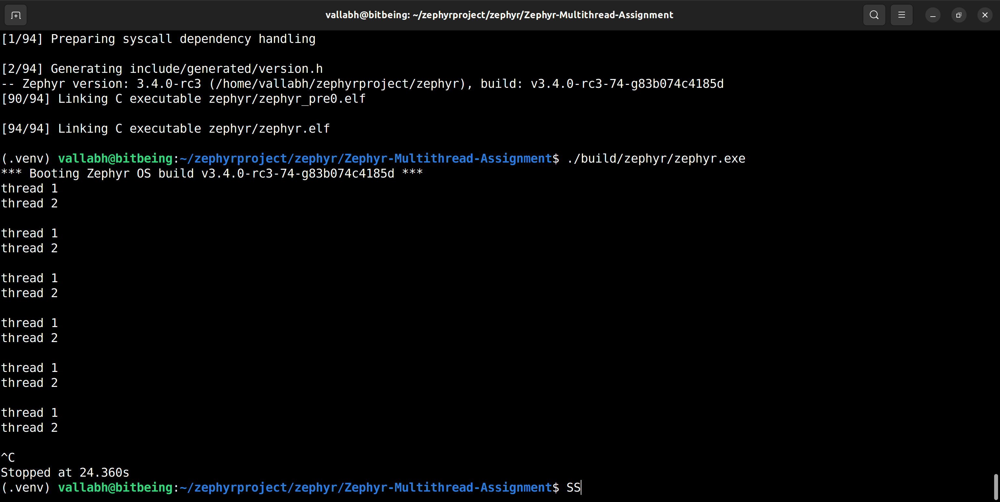

# Zephyr Thread Assignment 
References used - [Basic thread example](https://github.com/zephyrproject-rtos/zephyr/blob/main/samples/basic/threads) & [Hello World](https://github.com/zephyrproject-rtos/zephyr/tree/main/samples/hello_world)

The `src/main.c` contains two threads wherein the first thread `thread1` prints "thread 1" and the time period between prints increments with steps of 1s and overflows back to 1s after 10s. The second thread `thread2` prints "thread 2" one second after print by getting a message from `thread1`.

# Assumptions
The repo is cloned in the `zephyrproject/zephyr/samples` folder in Ubuntu 22.04 LTS.
The python environment is activated before building.


# Pseudocode 
```
// Define thread stack size, priorities and message queue
//set initial interval
min_delay = 1 second

// Thread 1 function
function thread1():
    interval=min_delay
    msg=false
    sleep for 1s to start the thread after 1s
    while True:
        print "thread 1"
        set msg=true and send message to thread2
        //to increment count and reset interval if overflow
        if interval >= 10 seconds:
            interval=1 second
        else:
            interval+=1 sec
        sleep(interval) //delay for next execution
        

// Thread 2 function
function thread2():
    while True:
        get message from thread 1
        if(received message==true):
            sleep for 1s
            print "thread 2"

// Create and spawn thread 1 
// Create and spawn thread 2

```


# Output
The native posix port of Zephyr is used to run the code present in `./build/zephyr/zephyr.exe`




# API references from [Zephyr Documentation](https://docs.zephyrproject.org/latest/index.html)
`k_msleep(int32_t ms)` -> used to put the current thread to sleep. This routine puts the current thread to sleep for duration milliseconds.

`msqg` -> Message Queue Structure

`void k_msgq_init(struct k_msgq *msgq, char *buffer, size_t msg_size, uint32_t max_msgs)`-> used to initialize a message queue.

`int k_msgq_get(struct k_msgq *msgq, void *data, k_timeout_t timeout)` -> used to receive the message from `thread1_entry` to `thread2_entry`

`K_THREAD_DEFINE(name, stack_size, entry, p1, p2, p3, prio, options, delay)` -> used to define and initialize the threads where the `stack_size` is 1024 for both the threads and the `prio` for thread1 and thread2 is set to 5 & 6 respectively.

# Steps to recreate
1. Clone the repo in the zephyrproject directory.
2. Activate the python environment `source ~/zephyrproject/.venv/bin/activate`
3. Delete the build folder to create a fresh build using `sudo rm -r build/`
4. Move to the folder and build for the native posix port - `west build -b native_posix`
5. To run the build - `./build/zephyr/zephyr.exe`
